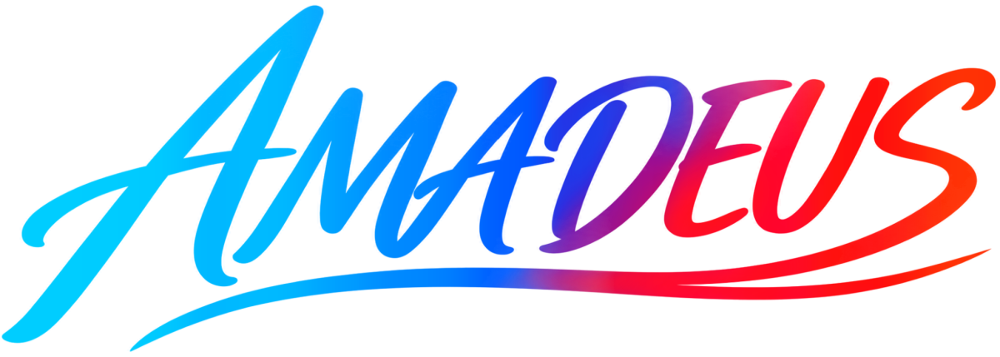

  

  
  
  

 

  <a href="https://amadeus.jpmyrmecol.com/">English</a> |
  <a href="https://amadeus.jpmyrmecol.com/jp/">日本語</a>

---

**Annotation-free Multi-Animal Direction Estimation Using Self-supervised learning**

AMADEUS is a markerless multi-animal tracking system for laboratory videos. It estimates an oriented bounding box (OBB) and head direction for each animal while maintaining individual identities over time. No manual training annotation or physical marking is required.

After you configure foreground segmentation, AMADEUS extracts single-animal blobs, assigns direction classes using movement direction, and synthesizes interaction images by copy-paste augmentation. A detector trained on these images estimates OBBs and direction classes during crossings and crowding. Staged association and refinement produce individual tracks. When almost complete occlusion is expected, contrastive learning is additionally used for identity verification and correction.

## Install and launch

### Recommended environment

AMADEUS supports **NVIDIA GPUs on Windows and Linux, Apple Silicon on macOS, and AMD GPUs via ROCm on Linux and Windows 11**.

For NVIDIA GPUs, **8 GB or more of VRAM is recommended**, although the required memory depends on factors such as video resolution and the number of animals. AMADEUS has also been confirmed to run on laptop GPUs with **4 GB of VRAM**.

AMD GPU support depends on ROCm compatibility with the GPU, operating system, and driver version.

Use the [installers on the website](https://amadeus.jpmyrmecol.com/#install), or clone this repository and run the launcher from its root directory.

| Operating system | Launcher |
| --- | --- |
| Windows 10 / 11 | Double-click `AMADEUS.bat` |
| macOS on Apple Silicon | Open `AMADEUS.command` |
| Linux / WSL2 | Run `bash AMADEUS.sh` |

For platform requirements, installation details, and troubleshooting, see the [manual](https://amadeus.jpmyrmecol.com/Manual_EN.html).

To update AMADEUS, select **Update** below **Help** on the Home screen. Review the version change and confirm to install; AMADEUS closes during the update and restarts when setup is complete.

## Run tracking

1. Open **Easy Tracking** and select the video and session folder.
2. Select **Launch Segmentation**. Configure foreground segmentation so that complete, isolated animals are retained as single-animal blobs and unsuitable regions are marked as outliers.
3. Specify the number of animals, overlap severity, and whether the animals move backward. Select **Processing** to run the workflow.
4. Review the result video and CSV. Use **Refinement** to correct remaining errors if needed.

Use **Advanced Tracking** to configure individual stages and parameters, or **Multi Config Batch** to run several saved configurations.

## Outputs and recording conditions

The standard output includes individual identity, OBB center and dimensions, and head direction in degrees over time. Front and rear keypoints are derived geometrically from OBBs. In the final CSV, columns named `heading` store head direction. See the [output format](https://amadeus.jpmyrmecol.com/Manual_EN.html#section-12) for coordinates, angles, and processing stages.

AMADEUS learns directly from the input videos. Recommended conditions include a fixed camera viewing animals from above, movement approximately confined to a two-dimensional plane, stable illumination, an essentially static background, and sufficient contrast, resolution, and frame rate for reliable visual tracking in each frame. Head direction estimation requires a body axis and visually distinguishable front and rear. The video must contain sufficient periods in which animals are separated from one another to generate training data. Training and analysis videos can be recorded separately under the same conditions.

**Variable population** supports animals entering or leaving the field of view, but an animal may receive a new ID after returning. **Without direction estimation** tracks OBBs and identities without assigning front or rear, allowing AMADEUS to be applied to animals without a visually distinguishable front and rear. See the [manual](https://amadeus.jpmyrmecol.com/Manual_EN.html#section-6) for these modes and their limitations.

## Citation

Preprint: Yusuke Notomi, Kentaro Matsumura, and Shigeto Dobata (2026). **AMADEUS: Annotation-free multi-animal direction estimation using self-supervised learning.** bioRxiv. https://doi.org/10.64898/2026.09.19.752854

See the [Publication page](https://amadeus.jpmyrmecol.com/publication.html) for citation information. Please also cite the project website: https://amadeus.jpmyrmecol.com/.

## License

AMADEUS is distributed under the GNU Affero General Public License v3.0 only (AGPL-3.0-only). See [LICENSE](LICENSE) and [third-party notices](THIRD_PARTY_NOTICES.md).

